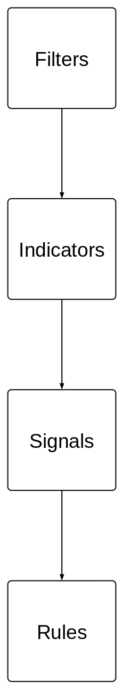
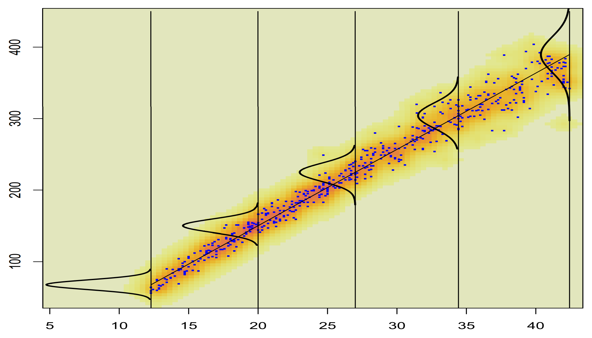
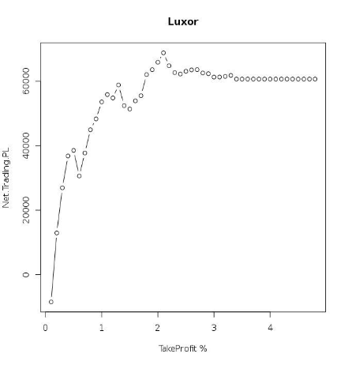
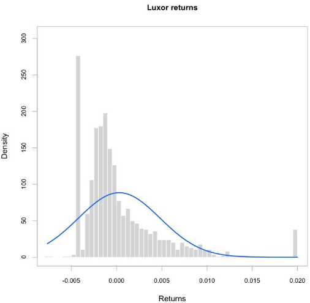
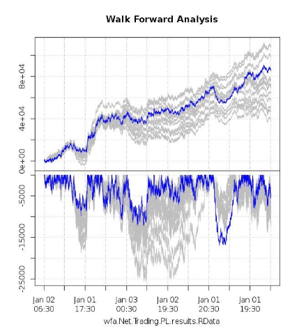
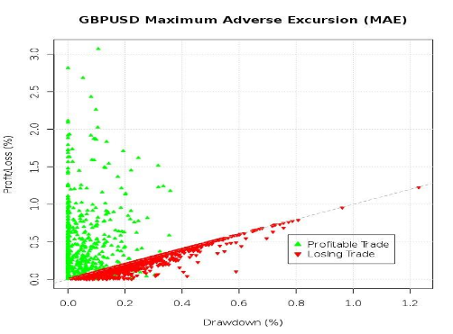

Backtesting, art or science?
=========================================================

*Back-testing. I hate it –- it's just optimizing over history. You never see a bad back-test. Ever. In any strategy.* - Josh Diedesch [-@Diedesch2014] CalSTRS

*Every trading system is in some form an optimization*. - Emilio Tomasini [-@Tomasini2009]

Moving Beyond Assumptions
=============================

Many system developers consider "*I hypothesize that this strategy idea will make money*" to be adequate.

- understand your business constraints and objectives
- build a hypothesis for the system
- build the system in pieces
- test the system in pieces
- measure how likely it is that you have overfit 

Constraints and Objectives
=============================

###Constraints

- capital available
- products you can trade
- execution platform

###Benchmarks

- published or synthetic?
- what are the limitations?
- are you held to it, or just measured against it?

###Objectives

- formulate objectives for testability
- make sure they reflect your real business goals

Building a Hypothesis
=============================
*Essentially, all models are wrong, but some are useful*. - George Box [-@Box1987]

\columnsbegin
\column{.35\textwidth}

\column{.65\textwidth}

To create a testable idea (a hypothesis), we need to:

\par

\par

- formulate a declarative conjecture
- make sure the conjecture is predictive
- define the expected outcome
- describe means of verifying (testing) the outcome

\columnsend

Building Blocks
=============================

\columnsbegin
\column{.67\textwidth}

\begin{center}
Separating the strategy into components aids testing, and increases productivity.
\end{center}

\column{.33\textwidth}

\columnsend

Definitions
=============================
\fontsize{8}{1.5}\selectfont

### Filters

- select the instruments to trade
- may be part of the hypothesis
- categorize market characteristics that are favorable to the strategy

### Indicators

- quantitative values derived from market data
- includes all common "technicals" such as moving averages, relative value, etc.

### Signals

- describe the interaction between filters, market data, and indicators
- can be viewed as a prediction at a point in time

### Rules

- make path-dependent actionable decisions

Test the System in Pieces, or, How to Screw Up Less
=============================
*Far better an approximate answer to the right question, which is often vague, than an exact answer to the wrong question, which can always be made precise*. - John Tukey [-@Tukey1962] p. 13 

\vfill

\begin{center}
Fail quickly, think deeply, or both?
\end{center}

\vfill

*No matter how beautiful your theory, no matter how clever you are or what your name is, if it disagrees with experiment, it’s wrong*. - Richard P. Feynman [-@Feynman1965]

Things to Watch Out For, or, Types of Overfitting
=============================

### Look Ahead Bias

- directly using knowledge of future events

### Data Mining Bias

- caused by testing multiple configurations and parameters over multiple runs, with adjustments between backtest runs
- exhaustive searches may or may not introduce biases

### Data Snooping

- knowledge of the data set can contaminate your choices
- making changes after failures without having strong experimental design 

Measuring Indicators
=============================

A good indicator is describing some measurable aspect of reality: 
a theoretical "fair value" price, or the impact of a factor on that price,
or turning points of the series, or slope.

- hypothesis and tests for the indicator
- custom 'perfect foresight' models
- lessons from signal processing: symmetric filters

If your indicator doesn't have testable information content, throw it out and start over.

Measuring Signals
=============================

\columnsbegin
\column{.45\textwidth}

Signals make predictions; all the literature on forecasting is applicable:

- mean squared forecast error, BIC, etc.
- box plots or additive models for forward expectations
- "revealed performance" approach of @Racine2009
- re-evaluate assumptions about the method of action of the strategy
- detect information bias or luck before moving on

\column{.65\textwidth}

\columnsend

Measuring Rules
=============================
\begin{center}
If your signal process doesn't have predictive power, stop now.
\end{center}

  - rules should refine the way the strategy 'listens' to signals
  - entries may be passive or aggressive, or may level or pyramid into a position
  - exits may have their own signal process, or may be derived empirically
  - risk rules should be added near the end, for empirical 'stops' or to meet business constraints

Parameter Optimization
=============================

\columnsbegin
\column{.5\textwidth}

\column{.5\textwidth}

\columnsend

Walk Forward
=============================

\columnsbegin
\column{.5\textwidth}

\column{.5\textwidth}

\columnsend

\begin{center}
Proper formulation of your business objective is critical to results.
\end{center}

Beware of Rule Burden
=============================

- having too many rules is an invitation to overfitting
- adding rules after being disappointed in backtest results is almost certainly an exercise in overfitting (data snooping)
- strategies with fewer rules are more likely to be robust out of sample

Measuring the Whole System
=============================

*Net profit as a sole evaluation method ignores many of the characteristics important to this decision*. - Robert @Pardo2008 

\vfill

\columnsbegin
\column{.7\textwidth}

\columnsend

Using Trade Statistics
=============================

\fontsize{11}{1.5}\selectfont

All trading and backtesting platforms (should) provide trade statistics:

  - number of trades w/ gross and net P\&L 
  - mean/median, standard deviation of trading P\&L per trade 
  - percent of positive/negative trades  
  - Profit Factor : absolute value ratio of gross profits over gross losses 
  - Drawdown statistics 
  - start-trade drawdown [@Fitschen2013, p. 185]
  - win/loss ratios of winning over losing trade P&L (total/mean/median) 

Dangers of aggregate statistics:

  - hiding the most common outcomes
  - focusing on extremes
  - not enough trades or history for validity
  - collinearities of overlapping "trades" 

Using Returns
=============================

- Returns create a *standard* mechanism for comparing 
multiple strategies or managers
- Choice of the denominator matters

Sample Analyses:

- tail risk measures
- volatility analysis
- factor analysis / factor model monte carlo
- style analysis
- comparing strategies in return space
- applicability to asset allocation

Asset Allocation
=============================

- we tend to do asset allocation studies only after strategies are in production.

- backtests are most often done on 1-lots, and initial scaling is done ad-hoc.

- strategy daily returns become returns of a synthetic asset (the strategy) as inputs to optimization

- optimizer should use your business objectives as the portfolio objective

Did we over do it?
=========================================================

*A big computer, a complex algorithm and a long time does not equal science*. - Robert Gentleman

Detecting Backtest Overfitting
=============================

- **White's Reality Check** : from @White2000 and @Hansen2005
- **k-fold cross validation** : improves single hold-out 
  model by randomly dividing the sample of size *T* into sequential 
  sub-samples of size *T/k*.[ @Hastie2009]
- **CSCV sampling** (combinatorially symmetric cross validation): "generate $S/2$ testing sets of size $T/2$ 
  by recombining the $S$ slices of the overall sample of size $T$ ". [@Bailey2014probability, p.17]
- **Multiple Hypothesis Testing** looks at Type I vs Type II error in evaluating 
  backtests and at appropriate haircuts based on these probabilities. [@Harvey2013backtesting ; -@Harvey2013multiple ; -@Harvey2014 ]

Conclusion & Questions
=========================================================

- understand the business context you operate in 
    - constraints
    - benchmarks
    - objectives
- separate the components of the strategy
- construct testable hypotheses at each step of the process
- evaluate the components separately
- test yourself often

Thanks
=========================================================

\vfill

\begin{center}
Thank You for Your Attention
\end{center}

\vfill

Thanks to my team, and my family, who make it possible.

\columnsbegin
\column{.5\textwidth}

©2014 Brian G. Peterson brian@braverock.com

\column{.1\textwidth}

\columnsend

\vfill

Code to apply the techniques discussed here may be found in the 
**R** *quantstrat*, *PerformanceAnalytics*, and *PortfolioAnalytics* packages. [@quantstrat2014; @perfa2014; @porta2014]

\vfill

All remaining errors or omissions should be attributed to the author. 
All views expressed in this presentation are those of Brian Peterson, 
and do not necessarily reflect the opinions or policies of DV Trading 
or DV Asset Management.  

Resources
=========================================================

\fontsize{4.5}{.75}\selectfont