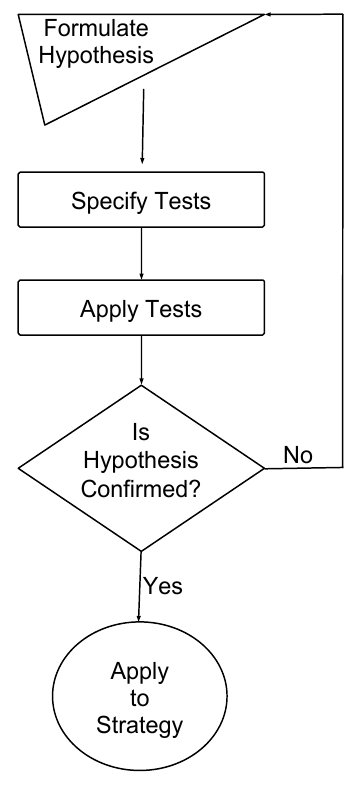
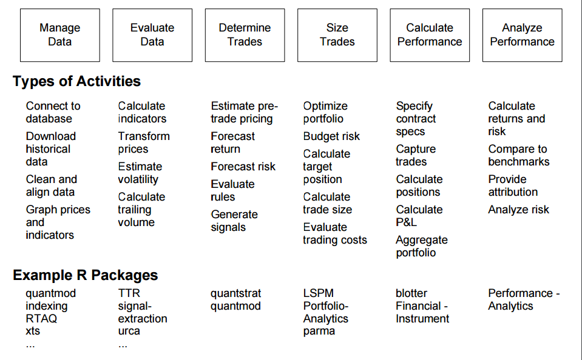
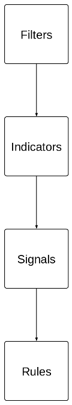
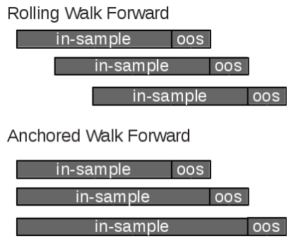

<style>
slides > slide { overflow: scroll; background: #E8E8E8; }
slides > slide:not(.nobackground):after {
  content: ''; background: #E8E8E8;
}
slides > slide:not(.nobackground):before {
  background: none;
}
</style>

```{r setup, include = FALSE, cache=FALSE}
knitr::opts_chunk$set(
  collapse = TRUE,
  comment = "#>",
  echo = FALSE,
  cache = TRUE
)
require(quantstrat)
require(knitr)
require(pander)
panderOptions("digits", 2)

source('tiingoapi.R')
# this file contains only one line:
# setDefaults(getSymbols.tiingo, api.key='MYAPIKEY')

require(doParallel) 
registerDoParallel() 

options("getSymbols.warning4.0"=FALSE)
options("getSymbols.yahoo.warning"=FALSE)

```

<style>
slides > slide { overflow: scroll; }
</style>

# Introduction

##  *Who is this Guy ?* | Proprietary/Principal Trading { .smaller }

__Brian Peterson:__

- quant, author, open source advocate
- author or co-author of over 10 packages for using R in Finance
- organization admin for [**R**](https://github.com/rstats-gsoc/)'s participation in [Google Summer of Code](https://summerofcode.withgoogle.com/)
- Lecturer, University Of Washington [Computational Finance and Risk Management](http://depts.washington.edu/compfin/)
- manage quant trading teams at several Chicago proprietary trading firms over time ... 

__Proprietary Trading:__

- proprietary or principal traders are a specific "member" structure with the exchanges
- high barriers to entry, large up-front capital requirements
- many strategies pursued in this structure have capacity constraints
- benefits on the other side are low fees, potentially high leverage
- money management needs to be very focused on drawdowns, leverage, volatility

## Backtesting, art or science?

&nbsp;

&nbsp;

*Back-testing. I hate it - it's just optimizing over history. You never see a bad back-test. Ever. In any strategy.* - Josh Diedesch (2014), CalSTRS

&nbsp;

&nbsp;

*Every trading system is in some form an optimization*. - Emilio Tomasini [-@Tomasini2009]


## Moving Beyond Assumptions

Many system developers consider 

<div class="centered">
"*I hypothesize that this strategy idea will make money*" 
</div>

to be adequate.

Instead, strive to:

- understand your business constraints and objectives
- build a hypothesis for the system
- build the system in pieces
- test the system in pieces
- measure how likely it is that you have overfit 

## Constraints and Objectives { .smaller }

__Constraints__

- capital available
- products you can trade
- execution platform

__Benchmarks__

- published or synthetic?
- what are the limitations?
- are you held to it, or just measured against it?

__Objectives__

- formulate objectives for testability
- make sure they reflect your real business goals

## Building a Hypothesis  {.columns-2 .smaller } 


```{r hypotheses, out.width = 220} 
   
```

&nbsp;

__To create a testable idea (a hypothesis):__

- formulate a declarative conjecture
- make sure the conjecture is predictive
- define the expected outcome
- describe means of verifying/testing

&nbsp;

__good/complete *Hypothesis Statements* include:__

- what is being analyzed (the subject), 
- dependent variable(s) (the result/prediction)
- independent variables (inputs to the model)
- the anticipated possible outcomes, including direction or comparison
- addresses *how you will validate or refute each hypothesis*

# Tools

## R in Finance trade simulation toolchain

```{r toolchain, out.width = 800} 
   
```


## Building Blocks {.columns-2 .smaller }


```{r building_blocks, out.width = 95} 
   
```


__Filters__

- select the instruments to trade
- categorize market characteristics that are favorable to the strategy

__Indicators__

- values derived from market data
- includes all common "technicals" 

__Signals__

- describe the interaction between filters, market data, and indicators
- can be viewed as a prediction at a point in time

__Rules__

- make path-dependent actionable decisions

## Installing *blotter* and *quantstrat*

- on Windows, you will need [Rtools](http://cran.r-project.org/bin/windows/Rtools/)

```{r install, eval=FALSE, echo=TRUE}

install.packages('devtools') # if you don't have it installed
install.packages('PerformanceAnalytics')
install.packages('FinancialInstrument')

devtools::install_github('braverock/blotter')
devtools::install_github('braverock/quantstrat')

```

## Our test strategy - MACD {.columns-2 .smaller}
```{r macd_setup, echo=TRUE, results='hide', cache=FALSE}
stock.str <- 'EEM'

currency('USD')
stock(stock.str,currency='USD',multiplier=1)

startDate='2003-12-31'
initEq=100000
portfolio.st='macd'
account.st='macd'

initPortf(portfolio.st,symbols=stock.str)
initAcct(account.st,portfolios=portfolio.st,initEq = initEq)
initOrders(portfolio=portfolio.st)

strategy.st<-portfolio.st
# define the strategy
strategy(strategy.st, store=TRUE)
```
```{r macd_data, echo=TRUE, results='hide', cache=FALSE}
## get data 
getSymbols(stock.str,
           from=startDate,
           adjust=TRUE,
           src='tiingo')
```

- we'll use MACD as a simple trend follower for illustration
- I am not advocating MACD as an investment strategy
- we hypothesize that our MACD strategy will detect durable trends
- we also hypothesize that it will get chopped up by sideways markets because of the lag in the moving average

&nbsp;

- don't pay a lot of attention to the code, this entire presentation is written using *rmarkdown* [@Rmarkdown], with references in BibTeX via [JabRef](http://www.jabref.org/) and has been compiled for this presentation

# Evaluating the Strategy

## Test the System in Pieces | How to Screw Up Less

*Far better an approximate answer to the right question, which is often vague, than an exact answer to the wrong question, which can always be made precise*. - John Tukey [-@Tukey1962] p. 13 

&nbsp;

<div class="centered">
Fail quickly, think deeply, or both?
</div>

&nbsp;

*No matter how beautiful your theory, no matter how clever you are or what your name is, if it disagrees with experiment, it’s wrong*. - Richard P. Feynman [-@Feynman1965]

## Add the indicator { .columns-2 .smaller }

```{r macd_indicator, echo=TRUE, results='hide', cache=FALSE}
#MA parameters for MACD
fastMA = 12 
slowMA = 26 
signalMA = 9
maType="EMA"

#one indicator
add.indicator(strategy.st, name = "MACD", 
      			  arguments = list(x=quote(Cl(mktdata)),
      			                   nFast=fastMA, 
      			                   nSlow=slowMA),
      			  label='_' 
)
```

&nbsp;

&nbsp;

&nbsp;

MACD is a two moving average cross system that seeks to measure:

- the momentum of the change
- the divergence between the two moving averages

Classical technical analysis, for example only, not widely deployed in production

## Measuring Indicators { .smaller }

What do you think you're measuring?
A good indicator measures something in the market: 

  - a theoretical "fair value" price, or 
  - the impact of a factor on that price, or 
  - turning points, direction, or slope of the series

Make sure the indicator is testable:

  - hypothesis and tests for the indicator
    - standard errors and goodness of fit
    - *t*-tests or *p*-value
  - goodness of fit
  - custom 'perfect foresight' model built from a periodogram or signature plot
  
<div class="centered">
*If your indicator doesn't have testable information content, throw it out and start over.*
</div>

## Specifying tests for Indicators

- facts to support or refute

- general tests
    - MSFE/MSFE
    - confusion matrix
    - standard errors
    - Monte Carlo errors


- specific tests
    - tests related to the model
    - tests of the prediction
    - tests of the relationships between variables

## General Diagnostics for Indicators

- Euclidean Distance
  - often squared
  - or de-meaned
  - or lagged to line things up
- clustering models
- piece-wise linear decomposition
- mean squared forecast error

## Add the Signals { .columns-2 .smaller }


```{r macd_signals, echo=TRUE, results='hide', cache=FALSE}
#two signals
add.signal(strategy.st,
           name="sigThreshold",
           arguments = list(column="signal._",
                            relationship="gt",
                            threshold=0,
                            cross=TRUE),
           label="signal.gt.zero"
)
   
add.signal(strategy.st,
           name="sigThreshold",
           arguments = list(column="signal._",
                            relationship="lt",
                            threshold=0,
                            cross=TRUE),
           label="signal.lt.zero"
)
```

## Combining Signals

Signals are often combined: 

<div class="centered">
"$A$ *&* $B$" should both be true.
</div>

This is a composite signal, and serves to reduce the dimensionality of the
decision space.

A lower dimensioned space is easier to measure, but is at higher risk of overfitting.

Avoid overfitting while combining signals by making sure that your process has a strong economic or theoretical basis before writing code or running tests

## Measuring Signals 

Signals make predictions so all the literature on forecasting is applicable:

- mean squared forecast error, BIC, etc.
- box plots or additive models for forward expectations
- "revealed performance" approach of @Racine2009
- re-evaluate assumptions about the method of action of the strategy
- detect information bias or luck before moving on

```{r macd_signal_dist, echo=TRUE}
add.distribution(strategy.st,
                 paramset.label = 'signal_analysis',
                 component.type = 'indicator',
                 component.label = '_', 
                 variable = list(n = fastMA),
                 label = 'nFAST'
)

add.distribution(strategy.st,
                 paramset.label = 'signal_analysis',
                 component.type = 'indicator',
                 component.label = '_', 
                 variable = list(n = slowMA),
                 label = 'nSLOW'
)
```

## Run Signal Analysis Study {.smaller .columns-2}
```{r macd_signal_dist_buy, echo=TRUE}
sa_buy <- apply.paramset.signal.analysis(
            strategy.st, 
            paramset.label='signal_analysis', 
            portfolio.st=portfolio.st, 
            sigcol = 'signal.gt.zero',
            sigval = 1,
            on=NULL,
            forward.days=50,
            cum.sum=TRUE,
            include.day.of.signal=FALSE,
            obj.fun=signal.obj.slope,
            decreasing=TRUE,
            verbose=TRUE)
```

```{r macd_signal_dist_sell, echo=TRUE}
sa_sell <- apply.paramset.signal.analysis(
             strategy.st, 
             paramset.label='signal_analysis', 
             portfolio.st=portfolio.st, 
             sigcol = 'signal.lt.zero',
             sigval = 1,
             on=NULL,
             forward.days=10,
             cum.sum=TRUE,
             include.day.of.signal=FALSE,
             obj.fun=signal.obj.slope,
             decreasing=TRUE,
             verbose=TRUE)
```

## Look at Buy Signal

```{r buy_signal_plot}
signal.plot(sa_buy$sigret.by.asset$EEM)
```


## Look at Buy Signal (cont.)

```{r buy_signal_bean_plot, results='hide' }
beanplot.signals(sa_buy$sigret.by.paramset$paramset.12.26)
```

## Look at Buy Signal (cont.)

```{r buy_signal_dist_plot, results='hide' }
distributional.boxplot(sa_buy$sigret.by.paramset$paramset.12.26$EEM)
```


## Look at Sell Signal

```{r sell_signal_plot}
signal.plot(sa_sell$sigret.by.asset$EEM)
```


## Add the Rules { .columns-2 .smaller }


```{r macd_entry, echo=TRUE, results='hide', cache=FALSE}

# entry
add.rule(strategy.st,
         name='ruleSignal', 
         arguments = list(sigcol="signal.gt.zero",
                          sigval=TRUE, 
                          orderqty=100, 
                          ordertype='market', 
                          orderside='long', 
                          threshold=NULL),
         type='enter',
         label='enter',
         storefun=FALSE
)

```

```{r macd_exit, echo=TRUE, results='hide', cache=FALSE}
# exit
add.rule(strategy.st,name='ruleSignal', 
         arguments = list(sigcol="signal.lt.zero",
                          sigval=TRUE, 
                          orderqty='all', 
                          ordertype='market', 
                          orderside='long', 
                          threshold=NULL,
                          orderset='exit2'),
         type='exit',
         label='exit'
)

```

## Measuring Rules { .smaller }

<div class="centered">
If your signal process doesn't have predictive power, stop now.
</div>

&nbsp;

  - rules should refine the way the strategy 'listens' to signals
  - entries may be passive or aggressive, or may level or pyramid into a position
  - exits may have their own signal process, or may be derived empirically
  - risk rules should be added near the end, for empirical 'stops' or to meet business constraints

__Beware of Rule Burden:__

- having too many rules is an invitation to overfitting
- adding rules after being disappointed in backtest results is almost certainly an exercise in overfitting (data snooping)
- strategies with fewer rules are more likely to be robust out of sample

## Run the Strategy

```{r macd_applyStrategy, echo=TRUE, results='hide', cache=FALSE}
start_t<-Sys.time()
out<-applyStrategy(strategy.st , 
                   portfolios=portfolio.st,
                   parameters=list(nFast=fastMA, 
                                   nSlow=slowMA,
                                   nSig=signalMA,
                                   maType=maType),
                   verbose=TRUE)
end_t<-Sys.time()

start_pt<-Sys.time()
updatePortf(Portfolio=portfolio.st)
end_pt<-Sys.time()
```

```{r macd_aS_timings, echo=FALSE}
print("Running the backtest (applyStrategy):")
print(end_t-start_t)

print("trade blotter portfolio update (updatePortf):")
print(end_pt-start_pt)
```

## Initial Results

```{r macd_chartPosn, echo=TRUE, fig.keep='last'}
chart.Posn(Portfolio=portfolio.st,Symbol=stock.str)
plot(add_MACD(fast=fastMA, slow=slowMA, signal=signalMA,maType="EMA"))
```

# Parameter Optimization

## Parameter Optimization

<center> *Every trading system is in some form an optimization. - @Tomasini2009 * </center>

&nbsp;

- all strategies have parameters: What are the right
ones?
- locate a parameter combination that most closely matches the hypotheses 
and objectives
- look for stable regions of both in and out of sample performance
- even your initial parameter choices are an optimization,
  you've chosen values you believe may be optimal
- parameter optimization just adds process and tools to
your investment decision

## What are good parameters?

- parameters are all the non-data inputs to your strategy
- they are the knobs and levers that control the model
- *good* parameters are parsimonious

    - not too many of them
    - not too loosely defined
    - each has a clear impact on the strategy performance
    - each is testable in a backtest
    
- production strategies have additional parameters that are specific to the production environment

## Limiting the number of parameters

- focus on the major drivers defined by your hypotheses
- if necessary, refine the hypotheses
- use ROC or effective parameter testing [@Hastie2009] to identify the
  major drivers in a small training and testing set
- limiting free parameters 

    - limits the opportunities to cherry pick lucky combinations
    - reduces the required adjustment for data mining bias [@Bailey2014deSharpe, @Harvey2013backtesting] 
    - reduces number of trials (resulting in faster parameter searches)
    
## Too Many Free Parameters

- increases your chance of overfitting
- larger numbers of free parameters vastly increase the amount of data you need
- more parameters lowers your degrees of freedom, and 

    - increases the chance that your chosen parameters are a false discovery
    
- goal should be to eliminate free parameters *before* running parameter optimization

## Moving from Free to Non-Free Parameters

- eliminate parameters where possible
- fix/freeze tertiary parameters next
- can you use production data to set less important parameters empirically?
- is there a model fitting method you could use instead? ( e.g. regression, maximum likelihood, Bayes)
- does this still count as a free parameter?

    - it depends on the complexity of the model/approach used to fit 
    - does your fitting model have parameters too?
    - what assumptions are you making?
    
## Robust Parameters

- small parameter changes lead to small changes in P&L and objective expectations
- out of sample deterioration is not large, on average 
- parameter choices have a sound theoretical or economic basis
- parameter variation should produce correlated differences in multiple objectives

## *quantstrat* Parameters

- *quantstrat* parameters are added via *add.distribution* 

    - they are identified with a parameter set (paramset) label via the *paramset.label* argument
    - the *component.type* argument tells quantstrat where to look for a variable (inicators, signals, rules, etc.)
    - the *component.label* argument must match the label used for the component earlier in the strategy
    - the *variable* argument tells *quantstrat* what to act on
    
- relationships (constraints) between parameters are set via *add.distribution.constraint*

## *quantstrat::add.distribution()* { .smaller }

```{r add.dist, echo=TRUE, results='hide', cache=FALSE}
.FastMA = (3:15)
.SlowMA = (20:60)
# .nsamples = 200 
#for random parameter sampling, 
# less important if you're using doParallel or doMC

### MA paramset
add.distribution(strategy.st,
                 paramset.label = 'MA',
                 component.type = 'indicator',
                 component.label = '_', #this is the label given to the indicator in the strat
                 variable = list(n = .FastMA),
                 label = 'nFAST'
)

add.distribution(strategy.st,
                 paramset.label = 'MA',
                 component.type = 'indicator',
                 component.label = '_', #this is the label given to the indicator in the strat
                 variable = list(n = .SlowMA),
                 label = 'nSLOW'
)

add.distribution.constraint(strategy.st,
                            paramset.label = 'MA',
                            distribution.label.1 = 'nFAST',
                            distribution.label.2 = 'nSLOW',
                            operator = '<',
                            label = 'MA'
)
```


## *quantstrat::apply.paramset()* {.smaller }

- creates param.combos from distributions and constraints
- runs applyStrategy() on portfolio for each param. combo
- nsamples: draws random selection
- audit: file name to store all portfolios and order books
- this takes over an hour on my laptop, and less than two minutes on my workstation

```{r apply.paramset, echo=TRUE, warning=FALSE, message=FALSE, results='hide'}
.paramaudit <- new.env()
ps_start <- Sys.time()
paramset.results  <- apply.paramset(strategy.st, 
                           paramset.label='MA', 
                           portfolio.st=portfolio.st, 
                           account.st=account.st, 
#                          nsamples=.nsamples,
                           audit=.paramaudit,
                           store=TRUE,
                           verbose=FALSE)
ps_end   <- Sys.time()
```

## paramset results {.smaller }
```{r param_timings, echo=FALSE, results='asis'}
cat("Running the parameter search (apply.paramset): \n ")
print(ps_end-ps_start)
cat("Total trials:",.strategy$macd$trials,"\n")
```
```{r paramset_plot, echo=TRUE}
plot(paramset.results$cumPL[-1,], major.ticks = 'years', grid.ticks.on = 'years')
```

## Search Process

- by default, *quantstrat* will use a brute force search by combining all parameters
- since the full brute force search space may be too large, you can use the *nsamples* argument to *apply.paramset* to sample from the whole parameter space
- more sophisticated sampling may be done using an optimizer (on my todo list to generalize)

## Parameter Regions

- @Tomasini2009 and @Pardo2008 both recommend finding stable parameter regions
- ideally, those regions will be "obvious" from first principles
- you can easily use *plot* to compare one parameter and one output, less easily 2-3 parameters
- for more complex parameter surfaces, 3-d surfaces or heat maps (e.g. via *contourplot*) are better

## Parameter distributions - Profit to Max Drawdown

```{r fig_profit_to_max_draw }
z <- tapply(X=paramset.results$tradeStats$Profit.To.Max.Draw,
            INDEX=list(paramset.results$tradeStats$nFAST,
                       paramset.results$tradeStats$nSLOW),
            FUN=median)
x <- as.numeric(rownames(z))
y <- as.numeric(colnames(z))
filled.contour(x=x,y=y,z=z,color = heat.colors,
               xlab="Fast MA",ylab="Slow MA")
title("Return to MaxDrawdown")
```

# Overfitting

## Things to Watch Out For, or, Types of Overfitting

__Look Ahead Bias__

- directly using knowledge of future events

__Data Mining Bias__

- caused by testing multiple configurations and parameters over multiple runs, with adjustments between backtest runs
- exhaustive searches may or may not introduce biases

__Data Snooping__

- knowledge of the data set can contaminate your choices
- making changes after failures without having strong experimental design 

<center> **NOTE:** *We just did all three of these things by optimizing over the entire series* </center>

## Degrees of Freedom

Pardo [-@Pardo2008, p. 130-131] describes the degrees of freedom of a strategy as:

- the number of of observations 
- minus all observations used by your indicators

In parameter optimization, we should consider the sum of observations used by
all different parameter combinations.

Goal should be to have 95% or more free parameters or 'free observations' even after parameter search.

## Applying Degrees of Freedom calculation

```{r dof, include=TRUE, echo=TRUE}
degrees.of.freedom(strategy = 'macd', portfolios = 'macd', paramset.method='trial')
degrees.of.freedom(strategy = 'macd', portfolios = 'macd', paramset.method='sum')
```

- there is a lot more information in the returned object, see *?dof* for more details

## Implications for Torture and Training sets

- to increase degrees of freedom, you may:

    - increase the length of market data consumed by the backtest
    - increase the number of symbols examined
    - decrease the number of free parameters
    - decrease the ranges of the parameters examined
    
- torture and training data sets should be large enough to still have reasonable 
  statistical confidence when you move to walk forward 
- this underlines the difficulty of doing extensive parameter searches on low frequency data

## Multiple testing bias

<center>
*Investment theory, not computational power, should motivate what experiments are worth conducting.* [@Bailey2014deSharpe, p. 10] 
</center>

&nbsp;

- we do want to test multiple hypotheses
- as we perform more tests, the likelihood of "discovering" an apparently significant result which is actually random increases
- as we perform more tests, this likelihood approaches 100%
- we need to be prepared to detect and correct for this multiple testing bias

## Deflated Sharpe

@Bailey2014deSharpe describes a way of adjusting the observed Sharpe Ratio of a 
candidate strategy by taking the variance of the trials and the skewness and 
kurtosis into account.

- corrects for selection bias from multiple testing on the same or related data (the parameter optimization)
- adjusts for non-normality of observed returns
- establishes theoretical maximum Sharpe for a series of related trials

- we have implemented a version with @Kipnis2017 as *SharpeRatio.deflated*

## Applying Deflated Sharpe Ratio

```{r deSharpe, echo=TRUE, eval=TRUE}
dsr <- SharpeRatio.deflated(portfolios='macd',strategy='macd', audit=.paramaudit)
```
```{r print.deSharpe, echo=FALSE, eval=TRUE}
kable(dsr)
```

- small numbers of trials will result in a small adjustment
- maximum computed Sharpe ratio relies on correlation of trials and moments
  of the distribution
- p-value is the assumed significance of the adjusted backtest, so low p-value 
  suggests a low probability of overfitting 
  
## Haircut Sharpe Ratio

- @Harvey2013backtesting proposes another method of correcting for the 
  multiple testing bias
- they propose three methods of adjusting the Sharpe Ratio for multiple related
  tests
- this research was mostly aimed at the proliferation of equity 'risk premia',
  but it is applicable to backtests where we have all the information as well
- Jasen @Mackie2016 implemented these methods in **R**, and 
- we have ported those methods to the *quantstrat* in *SharpeRatio.haircut*

## Applying the Sharpe Ratio Haircut {.smaller}

```{r hairSharpe, echo=TRUE, eval=TRUE}
hsr <- SharpeRatio.haircut(portfolios='macd',strategy='macd',audit=.paramaudit)
```
```{r print.hairSharpe, echo=FALSE, eval=TRUE}
print(hsr)
```

## Monte Carlo and the bootstrap | Sampling from limited information

- estimate the 'true' properties of a distribution from incomplete information
- evaluate the likelihood (test the hypothesis) that a particular result is 
    - not the result of chance
    - not overfit
- understand confidence intervals for other descriptive statistics on the backtest
- simulate different paths that the results might have taken, if the ordering had been different
  
## History of Monte Carlo and bootstrap simulation
- Laplace was the first to describe the mathematical properties of sampling from a distribution
- Mahalanobis extended this work in the 1930's to describe sampling from dependent distributions, and anticipated the block bootstrap by examining these dependencies
- Monte Carlo simulation was developed by Stan Ulam and John von Neumann (with computation by Françoise Ulam) as part of the hydrogen bomb program in 1946 (Richard Rhodes, **Dark Sun**, p.304)
- computational implementation of Monte Carlo simulation was constructed by Nicholas Metropolis on the ENIAC and MANIAC machines 
- Metropolis was an author in 1953 of the prior distribution sampler extended by W.K Hastings to the modern Metropolis-Hastings form in 1970
- Maurice Quenouille & John Tukey created 'jackknife' simulation in the 1950's
- Bradley Efron described the modern bootstrap in 1979

## Simulation from the equity curve using daily P&L  { .tiny }

Sampling Without replacement:

  - results have same mean and final P&L, allows inference on likely error bounds

Sampling With Replacement:

  - provides multiple paths; block sampling, with replacement
    - mimics some of  the autocorrelation structure of returns
    - may create deeper drawdowns if down streaks are effectively repeated
  - choosing block size
    - some multiple of average holding period, 1/5 or 1/4 holding period is a good guess
    - block size equal to observed significant autocorrelation
    - variable distribution of block size centered around one of the above, with tails

Disadvantages of Sampling from portfolio P&L:

- not transparent
- potentially unrealistic
- really only a statistical confidence model
- path won't line up with historical market regimes

## Empirical Example, with replacement {.columns-2}

```{r mcsim.replacement, echo=TRUE}

rsim <- mcsim(  Portfolio = "macd"
               , Account = "macd"
               , n=1000
               , replacement=TRUE
               , l=1, gap=10)
rblocksim <-  mcsim(  Portfolio = "macd"
               , Account = "macd"
               , n=1000
               , replacement=TRUE
               , l=10, gap=10)
```

P&L Quantiles: 

```{r mcsim.rquantile, echo=FALSE}

pander(quantile(rsim))
pander(quantile(rblocksim))

```

## Empirical Example,  With replacement, cont. {.columns-2}


```{r mcsim.plotrsim, echo=FALSE, fig.width=4, fig.height=2.25, fig.keep='last'}
plot(rsim)
lines (cumsum(dailyEqPL('macd.241',Symbols = stock.str, envir=.paramaudit)),on = 0,col = 'blue')
```

```{r mcsim.histrsim, echo=FALSE, fig.width=4, fig.height=3.5}
hist(rsim, cex=.5, methods='maxDD')
```

```{r mcsim.plotblocksimr, echo=FALSE, fig.width=4, fig.height=2.25}

plot(rblocksim)
```

```{r mcsim.histblocksimr, echo=FALSE, fig.width=4, fig.height=3.5}
hist(rblocksim, methods='maxDD')
```

## **INSERT CSCV/PBO HERE**

```{r paramset_cleanup, echo=FALSE, results='hide'}
rm(.paramaudit, paramset.results, ps_start, ps_end)
```

## other bootstrapping methods

- White’s Data Mining Reality Check from @White2000
  http://www.cristiandima.com/white-s-reality-check-for-data-snooping-in-r/

- bootstrap optimization as an option in LSTM [@Vince2009]

- discussion in Aronson [-@Aronson2006, p. 230-240] 
- using resampled market data, with or without multi-asset dependence, to train or run the system
- k-fold cross validation
- combinatorially symmetric cross-validation (CSCV) and probability of backtest overfitting (PBO) from @Bailey2014probability

## Simulation with round turn trades

  - resampling entries and exits
    - round turn size, direction, duration are sampled from the trades
    - also resample from any flat periods
    - applied in order to market data as new transactions at the then-prevalent price
  - trade expectations in the random-trade model, compared to backtest expectations
    - Drawdowns and tail risk, as in other simulation types
     
## Dis/advantages of bootstrapping trades

Disadvantages:

  - much more complicated to model trade dynamics
  - maintaining constraints e.g. max position
  
Advantages:

  - can more closely compare strategy to random entries and exits with same overall dynamic
  - creates a distribution around the trading dynamics, not just the daily P&L
  - effectively creates simulated traders with  the same style as strategy but no skill
  
  - best for modeling **"skill vs. luck"**  
  
## Outline of Trade Resampling Process { .smaller }

**Extract Stylized Facts from the observed series: **

  - duration, quantity, direction of round turns
  - total time in market
  - %-time long/short/flat
  - number of layers and maximum position

**For each replicate:**

  - sample, w/ or w/o replacement, from long/short/flat trades
  - construct the first/base layer for the replicate
  - first layer preserves long/short/flat ratios
  - add long/short layers on top of long/short periods

**For the collections of start/qty/duration:**

  - construct portfolios for all replicates
  - construct opening/closing transactions from start/qty/duration collections
  - apply those transactions to each replicate portfolio

## Empirical Example

```{r txnsim1, echo=TRUE}

# nrtxsim <- txnsim( Portfolio = "macd"
#                  , n=250
#                  , replacement=FALSE
#                  , tradeDef = 'increased.to.reduced')

wrtxsim <- txnsim( Portfolio = "macd"
                 , n=250
                 , replacement=TRUE
                 , tradeDef = 'increased.to.reduced')

```

Comments: 

- without replacement samples identical number of trades, randomizing start date
- with replacement samples number of trades to get correct total duration
- entry and exit prices are set at the time of each trade, from current market

## Empirical Example,  With replacement {.columns-2}


```{r txnsim.plotwr, echo=FALSE, fig.width=4.5, fig.height=2.8}
wrtxsim.pl <- plot(wrtxsim)
```

P&L Quantiles:

```{r txnsim.wrquantile, echo=FALSE}

pander(quantile(wrtxsim))

```

```{r txnsim.wrhist, echo=FALSE, fig.width=4.5, fig.height=4}
wrplvector<-as.numeric(last(wrtxsim.pl))
btpl<-wrplvector[1]
hist(wrplvector, main='Histogram of Cumulative P&L', breaks=25)
abline(v = btpl, col = "red", lty = 2)
b.label = ("Backtest P&L")
h = rep(0.2 * par("usr")[3] + 1 * par("usr")[4], length(wrplvector))
text(btpl, h, b.label, offset = 0.2, pos = 2, cex = 0.8, srt = 90)
abline(v=median(wrplvector), col = "darkgray", lty = 2)
c.label = ("Sample Median")
text(median(wrplvector), h, c.label, offset = 0.2, pos = 2, cex = 0.8, srt = 90)
```

## Overfitting summary

- the best way to prevent overfitting is via careful experiment design
- if your signal process isn't predictive, you should never get to the point of constructing a full backtest
- avoid free parameters where possible
- use as much data, and as many instruments, as you can

# Walk Forward

## Walk Forward { .columns-2 }

- walk forward analysis periodically reparameterizes the strategy 
- in production, this could be done daily, weekly, monthly, or quarterly 
- rolling window analysis is the most common, assumes evolving parameter space 
- anchored analysis assumes that the residual information from earlier periods helps you make decisions now

{width=40%} 

## Applying Walk Forward

- apply parameter optimization via *walk.forward*
- consider choice of objective
 
    - Sharpe ratio
    - minimize drawdown
    - profit to max draw
    - multiple objective optimization
    - default choice of best in-sample generally a bad idea
    
- be careful about performing walk forward analysis then making changes

- more trials increases bias

## *quantstrat::walk.forward* { .columns-2 .smaller }

```{r walk.forward, echo=TRUE}
wfportfolio <- "wf.macd"
initPortf(wfportfolio,symbols=stock.str)
initOrders(portfolio=wfportfolio)
wf_start <- Sys.time()
wfaresults <- walk.forward(strategy.st, 
                           paramset.label='MA', 
                           portfolio.st=wfportfolio, 
                           account.st=account.st, 
#                           nsamples=100,
                           period='months',
                           k.training = 48,
                           k.testing = 12,
                           verbose = FALSE,
                           anchored = FALSE,
                           audit.prefix = NULL,
                           savewf = FALSE,
                           include.insamples = TRUE,
                           psgc=TRUE
                          )
wf_end <-Sys.time()
```                        

## Walk Forward Results
```{r walk.forward._timings, echo=FALSE}
cat("\n Running the walk forward search: \n ")
print(wf_end-wf_start)
cat(" Total trials:",.strategy$macd$trials,"\n")
```
```{r walk.forward.table, echo=FALSE}
kable(wfaresults$tradeStats)
```

## Walk Forward Results (cont.)
```{r walk.forward.chart, eval=TRUE, echo=TRUE}
chart.forward(wfaresults)
```

## **ADD WFA OOS STATS HERE**

```{r wfa.testparams.table, echo=FALSE}
kable(wfaresults$testing.parameters[c(3,1,2)])
```

- testing period OOS ranks, w/ chosen paramset
- OOS deterioration for best/chosen paramset

## Risk of Ruin
Strong hypotheses guard against risk of ruin.

*I hypothesize that this strategy idea will make money.*

Specifying hypotheses at the beginning reduces the urge to modify them later and:
- adjust expectations while testing
- revise the objectives
- construct *ad hoc hypotheses*

*seek to answer what and why before going too far*

## Future Work

- more overfitting work
- modular objective for walk forward and parameter optimization
- optimizer for parameter optimization and walk forward objectives
- more machine learning examples

<div class="centered">
*we always have more work than time, so please talk to us if you want to work on these*
</div>

## Conclusion

- backtesting is a process of trial and error (mostly error)
- build a process that is grounded in stating and testing hypotheses
- trials should be kept track of, and counted against your eventual success
- multiple adjustments exist, examine

    - as many as you have data for
    - the ones that make sense for your trade
    - methods that can help you answer questions
    
- stay skeptical of your results

##{ .smaller }

<div class="centered">
*Thank You for Your Attention*
</div>

&nbsp;

Thanks to all the contributors to quantstrat and blotter, especially Ross Bennett, Peter Carl, Jasen Mackie, Joshua Ulrich, my team, and my family, who make it possible.

©2018 Brian G. Peterson brian\@braverock.com


This work is licensed under a [Creative Commons Attribution 4.0 International License](http://creativecommons.org/licenses/by/4.0/)

The *rmarkdown* [@Rmarkdown] source code for this document may be found on
[github](https://github.com/braverock/quantstrat/vignettes/quantstrat-RFinance-2018.html)

```{r versions, include=TRUE}
si<-sessionInfo()
cat( 'prepared using blotter:',si$otherPkgs$blotter$Version
    ,' and quantstrat:', si$otherPkgs$quantstrat$Version,'\n')
```

All views expressed in this presentation are those of Brian Peterson, 
and do not necessarily reflect the opinions, policies, or practices of Brian's employers.  

All remaining errors or omissions should be attributed to the author. 


<style>
slides > slide { overflow: scroll; }
slides > slide:not(.nobackground):after {
  content: '';
}
slides > slide:not(.nobackground):before {
  background: none;
}
</style>

# References

## References {.smaller}
<small><small>
